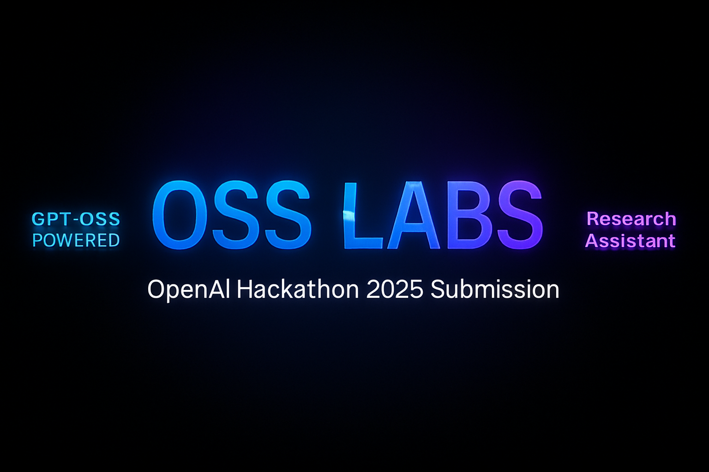

# OSS_Lab - AI Research Assistant Platform

<div align="center">



**Democratizing AI research with an open-source, full-stack platform powered by OpenAI's gpt-oss models**

[](https://opensource.org/licenses/MIT)
[](https://www.python.org/downloads/)
[](https://nextjs.org/)
[](https://fastapi.tiangolo.com/)

</div>

## 🎥 Demo Video

[](https://youtu.be/Bpcilc9F40I?si=WTcL1B_rf89mRYjr)

> **Watch the complete demo**: See OSS_Lab in action - from simple conversations to automated Jupyter notebook generation with gpt-oss-120b models!

## 🌟 Overview

OSS_Lab is a comprehensive AI research platform that combines the power of OpenAI's gpt-oss models with intuitive interfaces and automated analysis workflows. Transform complex data analysis into interactive notebooks and insights with just a conversation.

### ✨ Key Features

- 🤖 **AI-Powered Chat Interface** - Stream responses from gpt-oss-120b in real-time
- 📊 **Automated Notebook Generation** - AI creates Jupyter notebooks from conversations  
- 🎨 **Professional UI/UX** - Dark/light themes with responsive design
- 🔍 **Integrated Search** - SearXNG integration for enhanced research capabilities
- 📁 **Multi-Format Support** - Handle CSV, JSON, Excel, and notebook files
- ⚡ **Real-Time Updates** - WebSocket architecture for instant responses

## 🚀 Quick Start
# Given at 
<div align="center">

</div>

## 🏗️ Architecture

### Backend (`python-agents/`)
```
python-agents/
├── main.py              # FastAPI application entry point
├── config.py            # Configuration and API keys
├── core/
│   ├── chat_manager.py  # Conversation management
│   └── agents/          # AI agent implementations
├── websocket/           # WebSocket connection management
└── conversations/       # Chat history and notebooks
```

### Frontend (`OSS_UI/`)
```
OSS_UI/
├── src/
│   ├── app/             # Next.js app router pages
│   ├── components/      # Reusable React components
│   ├── lib/             # Utility functions and hooks
│   └── styles/          # Global styles and themes
├── public/              # Static assets
└── package.json         # Dependencies and scripts
```

### Search Engine (`searxng-master/`)
- Privacy-focused search engine
- Provides enhanced web search capabilities
- Integrates with the main application for research queries

## 🤖 AI Integration

### gpt-oss Model Usage

OSS_Lab leverages OpenAI's gpt-oss-120b model through the Groq API for:

- **Conversational AI**: Natural language interactions with context awareness
- **Code Generation**: Automatic creation of analysis scripts and notebooks
- **Data Analysis**: Intelligent interpretation of datasets and trends
- **Research Assistance**: Comprehensive answers with web search integration

### Example Workflow

1. **Upload Data**: Drop a CSV file into the chat interface
2. **Ask Questions**: "Analyze this sales data and show trends"
3. **Get Insights**: AI generates analysis and creates a Jupyter notebook
4. **Explore Results**: Interactive notebook with code, visualizations, and explanations

## 📖 Usage Guide

### Basic Chat

1. Open http://localhost:3000
2. Start typing in the chat interface
3. AI responds using gpt-oss models
4. Upload files for analysis by clicking the paperclip icon

### Data Analysis

1. Upload a CSV, JSON, or Excel file
2. Ask questions about your data
3. AI automatically generates analysis code
4. View results in the integrated notebook viewer
5. Export notebooks for sharing

### Settings Configuration

1. Navigate to Settings in the sidebar
2. Enter your Groq API key  
3. Configure AI features and preferences
4. Choose between light and dark themes

## 🤝 Contributing

We welcome contributions to OSS_Lab! Here's how to get started:

### Development Setup

1. Fork the repository
2. Create a feature branch: `git checkout -b feature/amazing-feature`
3. Make your changes
4. Add tests if applicable
5. Commit your changes: `git commit -m 'Add amazing feature'`
6. Push to the branch: `git push origin feature/amazing-feature`
7. Open a Pull Request

### Contribution Guidelines

- Follow existing code style and conventions
- Add tests for new functionality
- Update documentation as needed
- Ensure all tests pass before submitting

### Areas for Contribution

- **AI Models**: Integration with additional open-source models
- **UI Components**: New visualization and interaction patterns  
- **Analysis Tools**: Specialized modules for different research domains
- **Documentation**: Tutorials, guides, and examples


## 🙏 Acknowledgments

- **OpenAI** for the incredible gpt-oss models
- **Groq** for ultra-fast inference infrastructure  
- **SearXNG** for privacy-focused search capabilities
- **The open-source community** for the amazing tools and libraries

## 📞 Support

- **Issues**: [GitHub Issues](https://github.com/MarvelBoy047/OSS_Lab/issues)
- **Discussions**: [GitHub Discussions](https://github.com/MarvelBoy047/OSS_Lab/discussions)
- **Demo Video**: [Watch on YouTube](https://youtu.be/Bpcilc9F40I?si=WTcL1B_rf89mRYjr)

---

<div align="center">

**Built with ❤️ for the OpenAI Open Model Hackathon 2025**

*Empowering researchers, students, and innovators worldwide*

[](https://youtu.be/Bpcilc9F40I?si=WTcL1B_rf89mRYjr)

</div>

